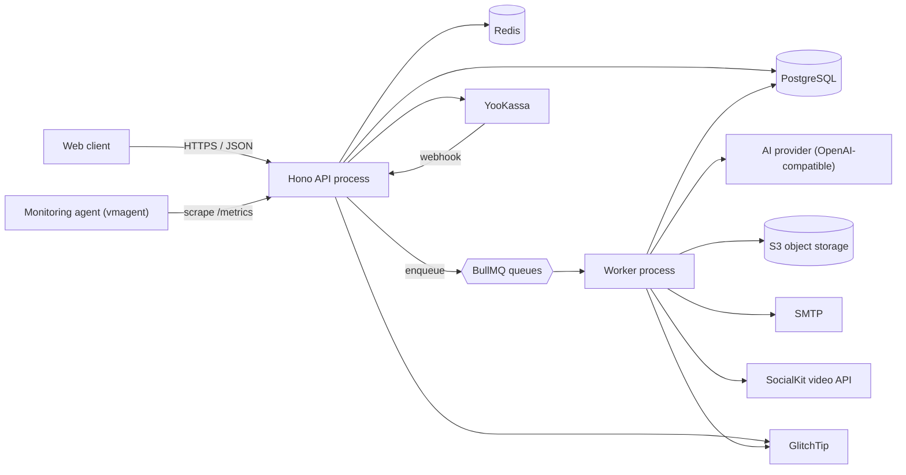

# Genario — Backend

**The API and generation engine behind Genario**, a product that turns a rough video idea
into a production-ready script: content ideas, a chaptered shooting script with per-scene
voice-over and visual directions, AI-generated scene previews, per-platform publication
metadata, and DOCX/PDF exports — plus the subscriptions, credit accounting and payments
that pay for all of it.

This repository holds the **backend**: a TypeScript ESM service built on Hono, PostgreSQL
and BullMQ, running as two processes — an HTTP API and a worker fleet.

> **Companion repositories:** [web client](https://github.com/genario-ru/frontend) ·
> [monitoring](https://github.com/genario-ru/monitoring)

---

## What the service is responsible for

| Area | Responsibility |
| --- | --- |
| **Creative profiles** | Import a YouTube/RuTube channel or accept a manual description, enrich its videos through an external video API, and derive a reusable profile (positioning, audience, tone, references) |
| **Idea generation** | Produce lists of video ideas grounded in a profile, template, tone and target platform |
| **Script generation** | Build chapters, then scenes within chapters — timecodes, voice-over, visual and sound directions — with full version history |
| **Scene previews** | Generate still images that illustrate individual scenes |
| **Publication metadata** | Write separate titles, descriptions and tags for each target platform |
| **Exports** | Render scripts and idea lists to DOCX and PDF, stored in S3 and delivered through pre-signed URLs |
| **Billing** | Tariffs, subscriptions, recurring charges, saved payment methods, refunds and payment webhooks via YooKassa |
| **Credits** | Per-feature credit metering with expiring credit batches and a usage ledger |
| **Platform** | Passwordless auth, transactional email, referrals, onboarding, legal documents, alerts, archive and search |

Twenty-six business domains live in `src/domains/**`; each owns its Zod schemas, services
and helpers.

---

## Architecture



Three runtime units ship together:

- **`migrate`** — a one-shot process that applies Drizzle migrations programmatically at
  deploy time. The API and workers refuse to start until it succeeds.
- **`server`** — the Hono HTTP API: request validation, authorization, persistence, job
  enqueueing, OpenAPI documentation and metrics.
- **`workers`** — BullMQ consumers that do everything slow: AI generation, media
  processing, exports, email and scheduled billing.

Splitting them matters because generation takes minutes, not milliseconds. HTTP requests
stay fast and predictable, work survives a deploy, retries and backoff are handled by the
queue, and the two processes can be scaled independently.

---

## Tech stack

| Area | Choice |
| --- | --- |
| Language / runtime | TypeScript (ESM, strict), Node.js |
| HTTP | Hono 4 with `hono-openapi` |
| Validation | Zod 4 on every request input and every response |
| API docs | OpenAPI document at `/api/open-api`, Scalar reference UI at `/api/docs` |
| Database | PostgreSQL with Drizzle ORM; versioned SQL migrations |
| Queues | BullMQ on Redis, with a Bull Board operations UI |
| Auth | Better Auth — email OTP, database sessions, admin plugin, Redis secondary storage |
| AI | OpenAI-compatible provider for structured output and image generation; prompts as Markdown templates with typed builders |
| External APIs | YooKassa (payments) and SocialKit (video data), clients generated by Kubb from their OpenAPI specs |
| Storage | S3-compatible object storage with pre-signed URLs |
| Documents | `docx` and `pdf-lib` for exports, `sharp` for image processing |
| Email | Nodemailer with React Email templates |
| Observability | `prom-client` metrics, Sentry SDK reporting to a self-hosted GlitchTip, request IDs |
| Tests | Vitest (unit and integration suites) |
| Build | `tsup` bundle, multi-stage Docker image |

---

## How a request is handled

Global middleware runs in a fixed order — secure headers, CORS, then origin validation
for everything under `/api/*` (payment webhooks are explicitly exempt, since a payment
provider has no browser origin), then HTTP metrics.

Protected endpoints then compose their own chain:

```text
sessionMiddleware → rateLimitMiddleware → subscriptionMiddleware
  → openAPIResponseMiddleware → validator → handler
```

Each step is a hard gate: no session, no request; over the rate limit, no request; no
active subscription, no request. Handlers stay free of authorization code, and a new
endpoint inherits the same guarantees by construction rather than by review.

Handlers themselves avoid defensive `try/catch`. Domain failures are raised through a
single typed error helper and rendered by one global error handler, so error shapes are
uniform across the whole API and appear correctly in the OpenAPI document. Responses are
parsed through their Zod schema before being sent — the contract is enforced on the way
out as well as on the way in.

---

## The asynchronous pipeline

Eighteen queues back the product's long-running work, each a `queue.ts` / `worker.ts` pair
under `src/mq/**`:

| Group | Queues |
| --- | --- |
| Script generation | chapters, scenes, chapter scenes, scene previews, metadata, metadata regeneration |
| Idea generation | idea-list generation, idea-list export |
| Profile import | channel video import, video attachment enrichment, video processing, video optimization, profiles from channels |
| Delivery | scenario version export, mail send |
| Scheduled billing | subscription charges, expiring credit-batch termination, upcoming-charge newsletter |

Generation is deliberately decomposed rather than done in one prompt: chapters first, then
scenes per chapter, then previews and metadata. Each stage is independently retryable,
partial results are useful to the user immediately, and one failed scene never invalidates
a whole script.

Recurring billing runs on the same infrastructure — repeatable jobs charge subscriptions,
expire credit batches and send upcoming-charge notices, with no external scheduler.

---

## AI prompt system

Every prompt is a triplet: a Markdown template in `src/ai/prompts/templates/`, a typed
props definition in `types/`, and a builder in `builders/` that interpolates explicit
variables and assembles optional context blocks.

Prompts are therefore reviewable as text and diffable in pull requests, while TypeScript
guarantees that a template's placeholders and its builder's inputs stay in sync. Models
answer through structured output, so responses are parsed into typed objects instead of
being scraped out of free-form text.

---

## Data model

Around sixty-five tables live in `src/db/schemas/**`, grouped by concern:

| Group | Contents |
| --- | --- |
| `primary` | Users, profiles, channels, scenarios, chapters, scenes, scene components, versions, metadata, ideas, idea lists, templates, attachments, exports, reference data |
| `billing` | Tariffs, discounts, subscriptions, payments, payment methods, refunds, credit packages, credit batches, credit usage |
| `auth` | Sessions, accounts, verification records |
| `linking` | Explicit join tables for many-to-many relations |
| `logs` | Email and generation logs |
| `jobs`, `referral`, `secondary` | Import jobs, referral codes/invites/rewards, alerts and notifications |

The schema is the single source of truth: migrations are generated from it and committed
alongside the change, and reference data ships as idempotent JSON seeds upserted by
primary key, so the repository — not a hand-edited database — defines the product's
catalogues.

---

## Security measures

**Authentication and sessions**
- Passwordless email OTP sign-in; the service never stores or verifies a password.
- One-time codes are held **encrypted** at rest.
- Sessions are persisted in PostgreSQL with Redis-backed secondary storage, delivered as
  cookies with a project-specific prefix and explicit `SameSite` attributes.
- Role-gated admin surface via the Better Auth admin plugin, with ban support and
  time-limited impersonation sessions.

**Request-level controls**
- Redis-backed rate limiting per endpoint, keyed by client IP and — once authenticated —
  by user; authentication endpoints are limited to three attempts per minute.
- Origin validation on the whole `/api/*` surface against a trusted-origin allowlist, with
  an explicit exemption only for the payment webhook.
- CORS restricted to known origins; secure HTTP headers applied globally.
- Zod validation of every path parameter, query string and JSON body, plus schema parsing
  of every response.
- Subscription and admin gates enforced as middleware, not inside handlers.

**Operational safety**
- `/metrics` and the Bull Board queue UI are restricted by IP allowlist, so internal
  operational surfaces are unreachable from the public internet even though they share the
  public domain. `/metrics` is only read from inside the Docker network by the monitoring
  agent, and the API publishes no host port — all traffic comes through the reverse proxy.
- A payments kill switch and a sign-up kill switch can disable money movement and
  registration through environment configuration alone, without a code change or deploy.
- All configuration is validated at boot with a typed env schema; the process refuses to
  start with a missing or malformed variable rather than failing later under load.
- No secrets in the repository: every credential is injected at deploy time, and only a
  placeholder `.env.example` is committed.
- Graceful shutdown drains in-flight HTTP requests and closes workers, so a deploy does not
  kill running generations mid-flight.
- Uploads are served through short-lived pre-signed URLs rather than public bucket paths.
- `eslint-plugin-security` runs across the codebase in linting.

---

## Observability

The service exposes Prometheus metrics — `genario_http_requests_total`,
`genario_http_request_duration_seconds` and `genario_http_requests_in_flight`, labelled by
route and status class. A monitoring agent on the same server discovers the API and the
PostgreSQL/Redis exporters (shipped in `docker-compose.yml`) by `monitoring.*` container
labels and pushes their metrics to the global
[monitoring stack](https://github.com/ilialksv/ilialksv-monitoring) for dashboards and
alerting on error rate and p95 latency. Unhandled errors from
both the API and the workers are reported to a self-hosted GlitchTip with release tagging,
every request carries a request ID, and Bull Board gives direct visibility into queue
depth, retries and failed jobs.

---

## Delivery

Pushes to `stage` and `prod` build a multi-stage Docker image, publish it to GitHub
Container Registry and trigger a Dokploy deployment. The runtime image is pruned to
production dependencies, so migrations run through a compiled programmatic runner rather
than a CLI that is no longer present. Compose orders the rollout: `migrate` completes
first, then `server` and `workers` start against the migrated schema.

---

## Repository map

| Path | Contents |
| --- | --- |
| `src/entrypoints/` | Process entrypoints: HTTP server, workers, migrations |
| `src/routes/` | Hono route modules, colocated per endpoint |
| `src/domains/` | Business domains: schemas, services, types, utilities |
| `src/db/` | Drizzle schemas, relations, migrations, seeds |
| `src/mq/` | BullMQ queues and workers |
| `src/ai/` | Prompt templates, builders, types, providers |
| `src/lib/` | Integrations: S3, Redis, YooKassa, SocialKit, mail, PDF, DOCX, images, Sentry |
| `src/middleware/` | Session, rate limiting, subscription, admin, CORS, origin validation, IP allowlist, metrics, kill switches |
| `src/shared/` | Cross-domain primitives, error and response schemas, server utilities |
| `src/codegen/` | Generated external API clients — never edited by hand |
| `tests/` | Vitest unit and integration suites |
| `AGENTS.md`, `CLAUDE.md`, `.cursor/`, `.agents/` | Working agreements and repeatable workflows for AI coding tools |

---

## License

Source-available for review only. See [LICENSE](LICENSE) — no permission is granted to
use, copy, modify or distribute this code.
